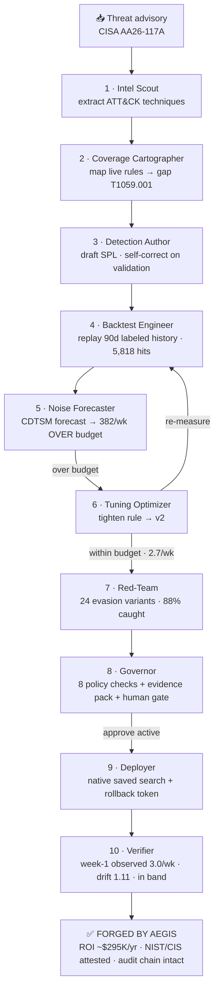
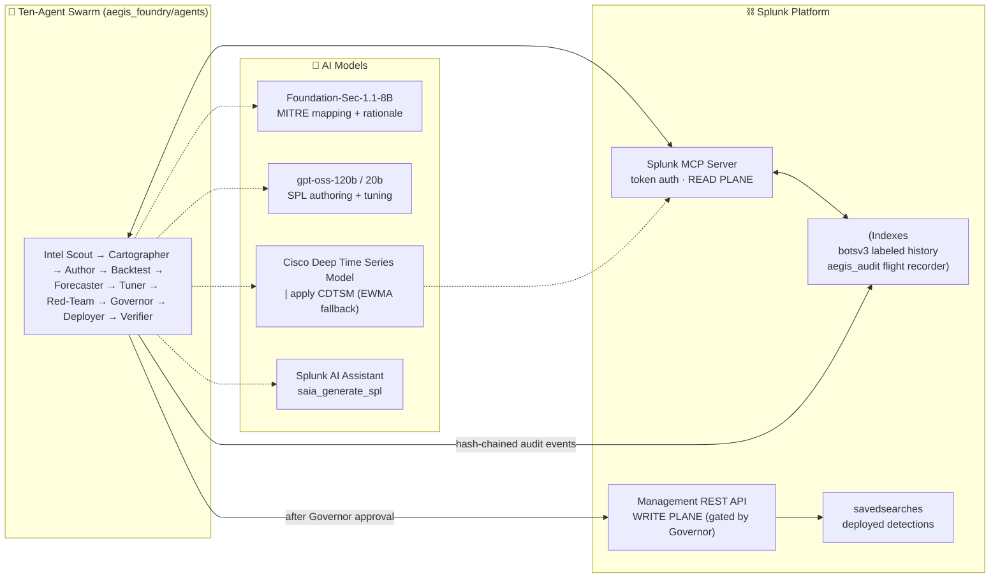
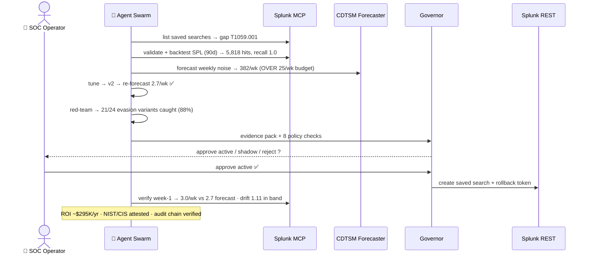

<div align="center">


<br/>

# ⬡ Aegis Foundry

### *The world's first autonomous detection-engineering platform for Splunk — the SOC that maintains itself*

<br/>

[](https://aegis-foundry.onrender.com)
[](https://www.splunk.com)
[](./tests)
[](../../actions/workflows/ci.yml)
[](./pyproject.toml)
[](./splunk_app)
[](./LICENSE)

<br/>

> **⚡ Hackathon:** Splunk Agentic Ops 2026 · **Track:** Security · **Bonus:** Hosted Models · MCP Server · Developer Tools

</div>

---

## 🎯 The Problem — Everyone Mops the Floor; Nobody Fixes the Faucet

```
╔══════════════════════════════════════════════════════════════════════╗
║  Every SOC runs hundreds of correlation searches.                    ║
║  A huge fraction are stale, schema-drifted, or never tuned.           ║
║                                                                      ║
║  ┌─────────────────────────┐   ┌──────────────────────────────────┐  ║
║  │  Alert TRIAGE            │   │  Detection ENGINEERING           │  ║
║  │  (downstream symptom)    │   │  (upstream — the real cause)     │  ║
║  │                          │   │                                  │  ║
║  │  ✅ AI triage copilots   │   │  ❌ Nobody automates this        │  ║
║  │  ✅ SOAR playbooks       │   │  ❌ Manual authoring (days)      │  ║
║  │  ✅ Alert rankers        │   │  ❌ Noise discovered in prod     │  ║
║  └─────────────────────────┘   └──────────────────────────────────┘  ║
║                                              ↑                       ║
║                                  THIS IS WHAT WE AUTOMATE            ║
╚══════════════════════════════════════════════════════════════════════╝
```

Alert fatigue is a **symptom**. The disease is untuned, unmeasured detection logic upstream. Every AI copilot that triages alerts faster is mopping the floor — none of them reduce the alerts that get created. Covering a new threat technique takes days to weeks: authoring, historical validation, false-positive tuning, change control — all manual.

**Aegis Foundry fixes the faucet.**

---

## ⚡ The Solution — A Governed, Self-Maintaining Detection Factory

<div align="center">

```
Advisory in → gap found → SPL authored → backtested → forecast-gated → red-teamed → governed → deployed → verified
     ↑                                                                                              ↑
 ATT&CK technique                                                          observed drift checked vs forecast
```

</div>

Aegis Foundry is a **ten-agent autonomous pipeline** that closes the entire detection lifecycle *inside Splunk*: it finds MITRE ATT&CK coverage gaps, authors SPL detections, backtests them against labeled history via the **Splunk MCP Server**, forecasts their alert-noise burden with the **Cisco Deep Time Series Model** *before* deployment, tunes them to a false-positive budget, **red-teams them against evasion variants**, gates them behind an evidence-pack + human approval, deploys them as native Splunk saved searches, and then verifies that reality matched the forecast — quantifying the dollar impact and attesting the framework controls satisfied. Every agent action lands in a **tamper-evident, hash-chained audit ledger**.

---

## 🔬 Three Core Innovations

<table>
<tr>
<td width="33%" align="center">

### 🔮 Forecast-Gated Deploy
**Price the noise before it ships**

The Cisco Deep Time Series Model forecasts a rule's future alert volume *before* deployment:

```
predicted/wk  vs  budget/wk
   382.3      >     25     ❌
    2.7       ≤     25     ✅
```

Over budget means it **does not ship**. Alert noise becomes a pre-deploy contract, not a post-deploy apology.

</td>
<td width="33%" align="center">

### ⚔️ Red-Team Gauntlet
**Verified vs the future, not the past**

Backtest recall measures history. The Red-Team agent mutates labeled attacks into MITRE-faithful evasion variants and replays them:

```
24 variants → 21 caught
adversarial recall = 88%
miss: -enc alias (flagged)
```

A real adversarial-robustness gate, not a vibe.

</td>
<td width="33%" align="center">

### 🔒 Provable Governance
**Trust as a feature**

Every deploy carries an **evidence pack** + **8 policy checks**, a human gate, and:

- SHA-256 **hash-chained audit** (tamper-evident)
- **ROI ledger** (~$295K/yr saved)
- **NIST 800-53 / CIS** attestation

Observable *and provable* in one pane of glass.

</td>
</tr>
</table>

---

## 🗺️ How It Works — Full Pipeline Flow



---

## 🏗️ Architecture — Read Plane vs Write Plane



> 📐 Full diagrams (system overview + sequence + deployment modes + trust boundaries) live in **[architecture_diagram.md](architecture_diagram.md)** at the repo root.

---

## 🔄 Default-to-Deploy Lifecycle — Sequence



---

## 🤝 The Ten-Agent Suite

<details>
<summary><strong>📂 Click to expand — all ten governed agents</strong></summary>

<br/>

| # | Agent | Purpose | Key Feature |
|:-:|-------|---------|-------------|
| 1 | `intel_scout` | Ingest intelligence | Extracts ATT&CK techniques from advisories (Foundation-Sec) |
| 2 | `coverage_cartographer` | Map coverage | Diffs intel vs live saved-search inventory → scored gaps |
| 3 | `detection_author` | Author SPL | Drafts detections, self-corrects against live syntax validation |
| 4 | `backtest_engineer` | Measure | Replays 90d labeled history via MCP → recall, precision, timeline |
| 5 | `noise_forecaster` | Forecast | `\| apply CDTSM` future weekly alert volume (honest EWMA fallback) |
| 6 | `tuning_optimizer` | Tune | Tightens over-budget rules into new versions until noise fits budget |
| 7 | `red_team` | Harden | Mutates attacks into evasion variants → adversarial recall |
| 8 | `governor` | Govern | 8 policy checks + evidence pack + human/policy approval gate |
| 9 | `deployer` | Deploy | Ships native Splunk saved search with a rollback token |
| 10 | `verifier` | Verify | Week-1 observed vs forecast band → ok / retune / auto-rollback |

</details>

---

## 🧪 Test Coverage — 39 Tests, Zero Compromises

| Test Suite | Tests | Status |
|---|:---:|:---:|
| Pipeline state & contracts | 4 | ✅ Passing |
| Mock MCP / pinned SPL dialect | 7 | ✅ Passing |
| Noise forecaster (CDTSM + fallback) | 3 | ✅ Passing |
| First-three-agents golden path | 2 | ✅ Passing |
| End-to-end storyline | 5 | ✅ Passing |
| Web console (real-HTTP e2e + approvals) | 4 | ✅ Passing |
| Red-Team gauntlet | 2 | ✅ Passing |
| ROI ledger | 4 | ✅ Passing |
| Tamper-evident audit chain | 4 | ✅ Passing |
| Compliance attestation | 4 | ✅ Passing |
| **TOTAL** | **39** | **✅ 39 / 39** |

CI runs lint (ruff) · unit tests (Python 3.11 + 3.12) · the offline golden-path demo · **AppInspect precert** (failures block the build).

---

## 🚀 Live Demo

<div align="center">

| Resource | Link |
|---------|------|
| 🌐 **Live Console** | [aegis-foundry.onrender.com](https://aegis-foundry.onrender.com) |
| 🖥 **Dashboard** | [aegis-foundry.onrender.com/console](https://aegis-foundry.onrender.com/console) |
| 📦 **GitHub** | [ismailridwans/aegis-foundry](https://github.com/ismailridwans/aegis-foundry) |

</div>

The console is an **eleven-view, navigation-driven operations dashboard** in liquid-glass design:

```
📊 Command Center  → ROI banner, headline KPIs, live feed
🔧 Pipeline        → the ten agents handing off live + per-agent detail
🛡  ATT&CK Coverage → gap cells flip to FORGED BY AEGIS + threat-intel feed
📈 Noise Lab       → backtest vs forecast + CDTSM confidence-band chart
⚔️  Red-Team       → adversarial-recall ring + evasion-variant ledger
⚖️  Governance     → browser approvals + 8-check policy gate + evidence packs
🚀 Deployments     → native saved searches + rollback token + drift
📋 Compliance      → NIST 800-53 / CIS Controls attestation
🛰  Flight Recorder → tamper-evident hash-chained audit ledger
🧠 AI Models       → the Cisco + Splunk model stack + live forecaster status
🕘 Run History     → every run and its headline outcome
```

> ⏱ Free Render tier sleeps after ~15 min idle — the first hit then wakes it in ~30–60s.

---

## ⛓ How Aegis Uses Splunk's AI Stack

| Splunk capability | Where it lives in Aegis Foundry |
|---|---|
| **Splunk MCP Server** (streamable HTTP, token auth) | [`core/mcp_client.py`](aegis_foundry/core/mcp_client.py) — the agents' *only* read plane: search, SPL validation, saved-search discovery |
| **Hosted: Cisco Deep Time Series Model** | [`core/hosted_models.py`](aegis_foundry/core/hosted_models.py) — `\| apply CDTSM`, honest labeled EWMA fallback |
| **Hosted: Foundation-Sec-1.1-8B** | MITRE mapping + rationale ([`agents/coverage_cartographer.py`](aegis_foundry/agents/coverage_cartographer.py)) |
| **Hosted: gpt-oss-120b / 20b** | SPL authoring + tuning ([`agents/detection_author.py`](aegis_foundry/agents/detection_author.py), [`agents/tuning_optimizer.py`](aegis_foundry/agents/tuning_optimizer.py)) |
| **AI Toolkit `\| ai` command** | [`core/llm.py`](aegis_foundry/core/llm.py) — completions routed through SPL so data stays in Splunk |
| **Splunk AI Assistant (`saia_*`)** | NL→SPL drafting path in the MCP client |
| **Python SDK app patterns** | [`splunk_app/`](splunk_app/) — alert action, ATT&CK Coverage + Flight Recorder dashboards |
| **AppInspect / Dev Tools** | [`scripts/package_app.py`](scripts/package_app.py) + [`ci.yml`](.github/workflows/ci.yml) precert job |

---

## ⚙️ Quick Start — Runs Offline in 60 Seconds (No Splunk, No Credentials)

```bash
# Clone and install
git clone https://github.com/ismailridwans/aegis-foundry.git
cd aegis-foundry
pip install -e .

# Run the full 10-agent pipeline against bundled fixtures
python demo/run_pipeline.py --auto-approve

# Launch the web console (landing + 11-view dashboard)
aegis-foundry ui                 # → http://127.0.0.1:8787

# Inspect a run
aegis-foundry audit              # the tamper-evident flight recorder
aegis-foundry heatmap            # ATT&CK coverage before/after

# Run the test suite (39 tests)
pip install -e .[dev] && pytest
```

Drop `--auto-approve` to experience the **human-in-the-loop** governance gate (active / shadow / reject), with shadow-deploy as the safe default.

**Prerequisites:** Python 3.10+. That's it for the offline demo — fixtures, fonts, and assets are all bundled.

<details>
<summary><strong>🌐 Live mode (real Splunk) — click to expand</strong></summary>

<br/>

Set `AEGIS_MODE=live`; the **same ten agents** drive a real deployment. Copy [`.env.example`](.env.example) and fill in:

| Variable | Purpose |
|---|---|
| `SPLUNK_MCP_URL` / `SPLUNK_MCP_TOKEN` | Splunk MCP Server (Splunkbase app), bearer-token auth |
| `SPLUNK_REST_URL` / `SPLUNK_REST_TOKEN` | Management REST API (the Deployer's governed write plane) |
| `AEGIS_BACKTEST_INDEX` | Labeled history — e.g. the public Splunk **BOTS v3** dataset (`botsv3`) |
| `AEGIS_LLM_BASE_URL` | Any OpenAI-compatible endpoint for the authoring models |

- **Splunk Cloud (hosted models):** AI Toolkit 5.7+ gives real `\| apply CDTSM` and `\| ai` access to Foundation-Sec / gpt-oss — data never leaves Splunk.
- **Anywhere (open weights):** `docker compose up -d splunk ollama`, `ollama pull gpt-oss:20b`. When CDTSM is unreachable the forecaster degrades to a deterministic EWMA model and labels itself `fallback-ewma` in every artifact.

</details>

---

## 🏆 Judging Criteria Alignment

<details>
<summary><strong>📋 Click to see how Aegis maps to every evaluation dimension</strong></summary>

<br/>

### ✅ Stage 1 — Theme & API Fit
**Genuinely agentic ops on Splunk.** Ten autonomous agents that *act* on Splunk (not a chat copilot), built on the **Splunk MCP Server**, **CDTSM**, **hosted models** (Foundation-Sec, gpt-oss), the **AI Toolkit `\| ai`** command, **SAIA**, and **AppInspect**.

---

### ✅ Technological Implementation
**10-agent state machine with a measurement/tune loop**, MCP + CDTSM integration, mock/live dual mode, **39 passing tests**, **green CI**, and an **AppInspect-validated** Splunk app. Tamper-evident hash-chained audit; self-correcting SPL authoring.

---

### ✅ Design
**Premium liquid-glass landing page + an 11-view operations console** — Command Center KPIs, live pipeline, ATT&CK forge, Noise Lab, Red-Team gauntlet, governance approvals, deployments, compliance, flight recorder. Verified live, zero JS errors.

---

### ✅ Potential Impact
**Quantified ROI: ~$295K/year** of analyst time saved on a single rule (449.8 alerts/week avoided), 99%+ noise reduction, days-to-minutes time-to-coverage. Attacks the cause of alert fatigue, not the symptom.

---

### ✅ Quality of Idea
**Upstream of triage** — every competitor ranks or summarizes alerts; Aegis reduces the alerts that get created. Forecast-gated deployment, adversarial red-teaming, and provable governance are each, individually, novel for a SOC tool.

</details>

---

## 🛡 Governance & Safety

- **Evidence packs** — SPL diff, backtest table, forecast band, adversarial-robustness results, and **8 policy checks** (true-positive preservation, noise budget, adversarial robustness, blast-radius scan, …).
- **Human-in-the-loop** — interactive approval with shadow-deploy as the safe default and timeout fallback.
- **Shadow mode & rollback** — every deployment returns a rollback token; the Verifier auto-rolls back runaway rules (>10× budget).
- **Tamper-evident flight recorder** — every decision is SHA-256 hash-chained; edit any past entry and `verify_audit_chain()` pinpoints the break.
- **Read/write separation** — agents read via MCP; the only write path (deployment) sits behind the Governor.

---

## 🧠 Why Aegis Stands Out

<div align="center">

| Dimension | Every Other SOC Tool | Aegis Foundry |
|-----------|----------------------|---------------|
| Where it acts | Downstream (triage) | **Upstream (detection engineering)** |
| What it produces | Ranked alerts | **Governed, deployed detections** |
| Noise control | Discovered in prod | **Forecast-gated before deploy** |
| Verification | Historical recall only | **+ adversarial red-team gauntlet** |
| Audit trail | Flat log | **SHA-256 hash-chained, tamper-evident** |
| Business case | Implicit | **Quantified ROI + NIST/CIS attestation** |
| Runs offline | Rarely | **Fully — 60-second demo, no credentials** |

</div>

---

## 📄 License

Apache-2.0 © 2026 Aegis Foundry — see [LICENSE](LICENSE).

<div align="center">
<br/>

**⬡ Aegis Foundry — Stop triaging. Start forging.**

*The SOC that maintains itself: autonomous, governed, verifiable detection engineering inside Splunk.*

<br/>

[](https://www.splunk.com)
[](https://www.cisco.com)
[](https://aegis-foundry.onrender.com)

</div>
