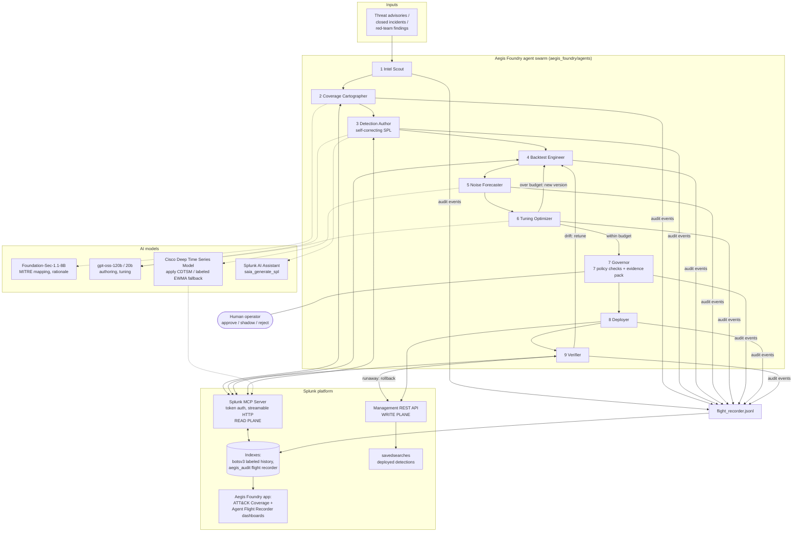
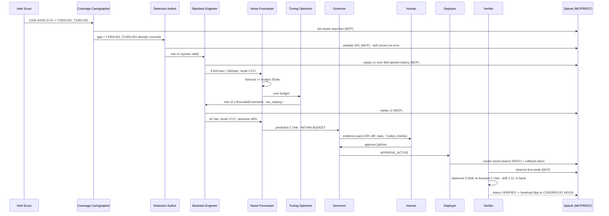
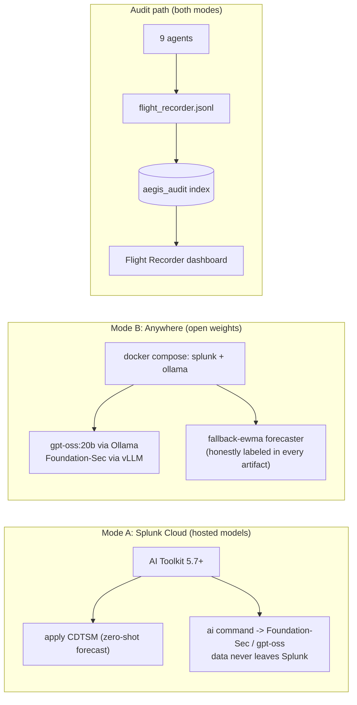

# Aegis Foundry — Architecture

How the nine-agent detection-engineering pipeline interacts with Splunk, how the AI models are
integrated, and how data flows between components.

## System overview

## One rule's lifecycle (sequence, with the demo's real numbers)

## Deployment modes and the audit path

## Data flow

1. **Ingest** — Intel Scout loads advisories (live: Splunk modular-input pattern; demo: `demo/fixtures/advisories.json`) and extracts MITRE techniques with the security LLM.
2. **Map** — Coverage Cartographer pulls the saved-search inventory through the **Splunk MCP Server**, maps each rule to techniques, and emits coverage gaps with risk scores.
3. **Author** — Detection Author drafts SPL (gpt-oss / `saia_generate_spl`), then validates syntax through MCP and self-corrects on parser errors.
4. **Measure** — Backtest Engineer replays the rule over labeled history (`botsv3`) via MCP and computes hits, precision, recall, and a continuous daily hit timeline. Noise Forecaster feeds that series to **CDTSM** (`| apply CDTSM`, or the labeled EWMA fallback) and converts the 14-day forecast into a predicted weekly alert rate vs. the false-positive budget.
5. **Tune** — over-budget rules go back to the Tuning Optimizer for a tightened version; the loop re-measures until within budget or attempts are exhausted.
6. **Govern** — the Governor runs 7 policy checks, writes the evidence pack, and gates on a human decision (active / shadow / reject).
7. **Deploy** — the Deployer creates the saved search through the **management REST API** with a rollback token; shadow deployments track without alerting.
8. **Verify** — the Verifier compares the first post-deploy week against the forecast band; drift triggers a re-tune, runaway noise triggers automatic rollback.
9. **Audit** — every step lands in the flight recorder (JSONL → `aegis_audit` index → dashboards): the agents are observable in Splunk itself.

## Trust boundaries

- **Read plane vs. write plane** — all agent *reads* go through the Splunk MCP Server (scoped bearer token, RBAC enforced server-side). The only *write* path (saved-search deployment, rollback) is the REST admin client, and it is reachable solely from the Deployer/Verifier **after** a Governor decision. A compromised or hallucinating authoring agent cannot deploy anything.
- **Model boundary** — in Splunk Cloud mode, prompts and telemetry stay inside the Splunk perimeter (hosted models via `| ai` / `apply CDTSM`). In open-weight mode, models run on infrastructure you control; no third-party AI API is required anywhere.
- **Human boundary** — `auto_approve` is an explicit demo/CI flag; the default path requires a human verdict, with shadow deploy as the safe default and rollback tokens on every change.
